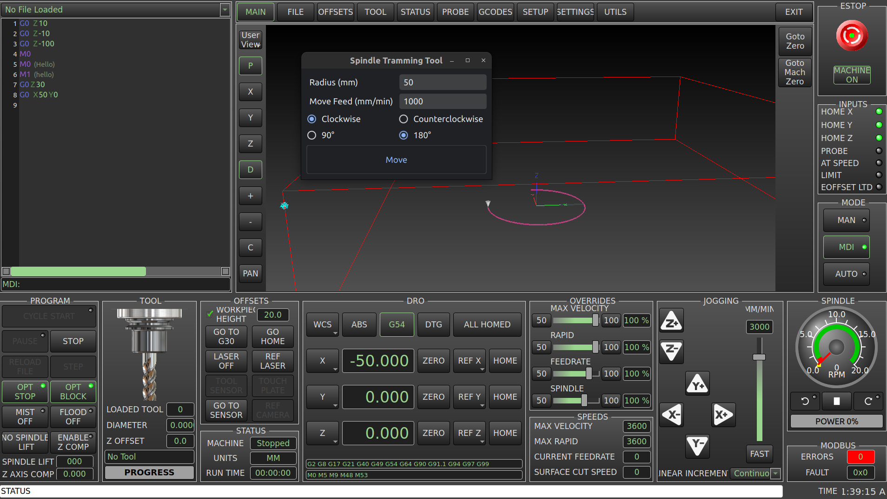

# Spindle Tramming Tool

This is a standalone tool used with linuxcnc (communicates with linuxcnc) to help with tramming in a spindle. Use a dial indecator in the collet. GUI has controls to move in arc rotations to keep the indecator from moving when it has some amount of preload onto it. 



Video:
https://youtu.be/L0tiNUSMYow?si=pLyVhTnOV17T1kwG

## Install

Suggest using virtualenv (include sitepackages aswell for being able to import linuxcnc package)
```bash
virtualenv --system-site-packages venv
```

After activating the virtual environment for the tool, use pip to install the libraries
```bash
pip install -r requirements.txt
```

Launch linuxcnc, launch the tool. The tool talks to linuxcnc remotly and runs standalone.

Launch the tool by running the shell script after making it executable (cmod +x the shell script)
